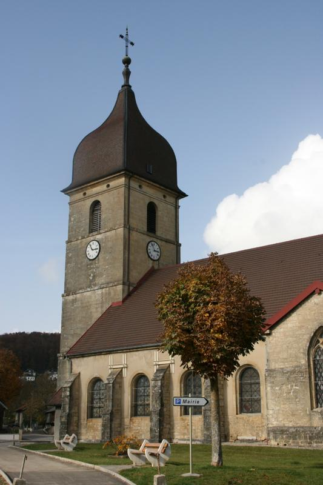
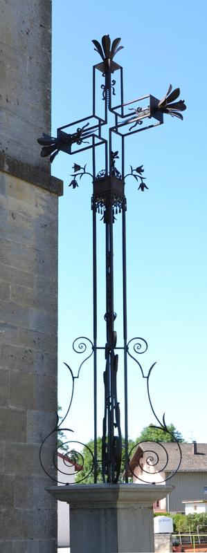

## Historique du village

Situé sur les rives du Drugeon, au cœur de vallons boisés, Dommartin est un charmant village du Doubs qui fut jadis l’ancien chef-lieu d’une petite seigneurie.

L’origine la plus simple du mot Dommartin est domus Martini (maison de Martin) ou Dominus Martinus (Seigneur Martin). Mais ce Martin, quel est-il ?

Il semble qu’on peut affirmer que Dommartin, comme beaucoup de paroisses, a pris le nom de son patron, qui en effet était l’évêque de Tours.

On peut d’ailleurs admirer l’église Saint Martin, de style gothique flamboyant, qui conserve un chœur flanqué de deux chapelles.

---

## La chapelle "Niai-Nion"

L’église Saint Martin dresse son traditionnel clocher comtois. La Chapelle de « Niai-Nion » fut érigée après la terrible épidémie de peste noire de 1636. « Niai-Nion « signifierait « je n’ai personne », dernières paroles prononcées par Jeanne Laignier, qui soigna les « pestiférés ».

Un aménagement des abords de la Chapelle a été réalisé, afin de proposer aux promeneurs une jolie ballade, en toute tranquillité

---

## L'église Saint-Martin

Eglise sous le vocable de Saint Martin date du XVIIème siècle.
La nef à été restaurée au XVIIIème Siècle.
Reconstruite au XIXème, son chœur est de style gothique.
Elle renferme 2 statues polychromes du XVIème siècle.

---

## La croix de Chemin

La réfection de la croix de chemin située près du porche de l’église a été engagée en novembre 2002 par le Ferronnier d’Art Didier Coutier de Montperreux.

Aucun renseignement bibliographique n’a pu être retrouvé dans les archives départementales ou les archives communales.

On ignore la date exacte et la circonstance de l’érection de cette croix. Ce type de croix date du 19ème siècle pendant lequel plusieurs variantes ont été réalisées dans le Haut-Doubs (La Planée, Longeville, Rochejean). Ces monuments préservent fréquemment des instruments de la passion.

Le piédestal couronné par une corniche est fait de béton et de pierre calcaire. Il porte le fût et le croisillon. Celui-ci est fleuronné et orné de vrilles. Un ostensoir se dresse dans l’axe. Au pied du croisillon, une tige garnie de 2 fleurs peut faire penser qu’il a pu exister d’autres éléments.

Autrefois, cette croix se dressait sur le devant du porche de l’église. Elle a été déplacée sur le côté du bâtiment lors de la suppression du cimetière autour de l’église et l’aménagement du carrefour.

Inscrite aux monuments historiques, cette croix, qui a supporté la dégradation du temps, a du subir une réfection de la partie fer forgé.

